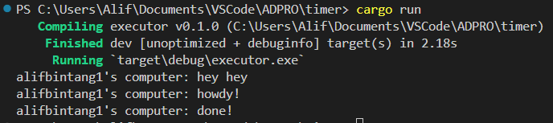

__1.2 Understanding how it works__

Berdasarkan hasil outputnya, dapat dipahami bahwa fungsi async akan dieksekusi di luar fungsi utama yang memanggilnya. Sebagai hasilnya, kemungkinan output " ... hey hey" akan muncul sebelum ".. howdy!" dan "... done!" karena kode "... hey hey" berada di luar fungsi async. 

Ini terjadi karena program akan melanjutkan eksekusi dan mencetak "hey hey" sedangkan fungsi async masih menunggu hasil dari future.